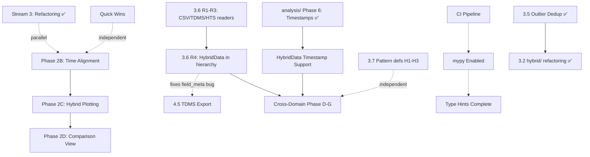

# Development Roadmap — python_magnetrun

*Updated: 2026-05-12*

This document outlines strategic priorities and upcoming work. For detailed implementation status, see [CHECK_IMPLEMENTATION.md](CHECK_IMPLEMENTATION.md). For architectural review, see [REVIEW.md](REVIEW.md).

---

## Current State

**Package Status:** Production-ready for core use cases ✅

**Major Achievements (2026 Q1-Q2):**
- ✅ Housing config consolidation (`HousingConfig` single source of truth; `Ih`/`Ib` via `Idcct`)
- ✅ Factory pattern (`load_magnetdata` replacing shim)
- ✅ Protocol unification (`DataLoader` protocol, Phase 2A complete)
- ✅ Timestamp convention (naive UTC across all loaders)
- ✅ Lazy loading (`PandasMagnetData._ensure_data_loaded` + `TdmsMagnetData._LazyGroupDict`)
- ✅ `Data` as abstract property on `MagnetDataBase` (+ `close()` / context manager)
- ✅ Resilient pupitre loading (encoding fallback, `on_bad_lines`, truncation check)
- ✅ `addData`/`computeData` metadata (`symbol`/`unit`/`label`/`description` → `FieldMeta`)
- ✅ `HybridRun.getData` formula-key resolution (`hybrid_formula_map` via `_resolve_hybrid_formula`)
- ✅ Downsampling refactoring (`DownsampleConfig` + shared utilities)
- ✅ Plotting refactoring (backend abstraction + 3 implementations)
- ✅ File validation infrastructure (integrated throughout)
- ✅ Logging infrastructure (`log_utils.py` + structured logging)
- ✅ Test coverage (validation, analysis, processing, CLI smoke tests, truncated pupitre, hybrid formula)
- ✅ `analysis/` subpackage refactoring (all 6 phases: data loading, downsampling, channel mapping, function decomposition, time-column utility)
- ✅ Outlier deduplication (canonical `python_magnetrun/outliers.py`; `hybrid/outliers.py` is a shim; `hysteresis.py` thin-delegates; `tests/test_outliers.py` 142 tests; `ISOLATION_FOREST` added to `OutlierMethod`)
- ✅ `hybrid/` subpackage refactoring — all 6 phases (`OutlierConfig` dataclass, `OUTLIER_DEFAULTS`, `processing/signal.py`, cache-eviction docstring, all-NaN / file-existence guards, typed exceptions; 866 tests pass)

---

## Strategic Priorities

### Priority 1: Stability & Quality (Ongoing)
**Goal:** Package must work reliably in production

### Priority 2: Unified Multi-Source Plotting
**Goal:** Display pupitre + pigbrother + hybrid data on shared axes or side-by-side comparison

### Priority 3: Code Maintainability
**Goal:** Sustainable long-term development with clear architecture

---

## Active Work Streams

### Stream 1: Production Stability (High Priority)

**Known Issues:**
1. **Multiple-file `vs_time` regression** *(commits 86c45c6/76351f3)*
   - Plot timing issues with multiple input files
   - **Action:** Investigate and fix
   - **Effort:** ~1-2 days

2. **CI/CD Pipeline** ✅ **Already in place**
   - `test.yml`: pytest on Ubuntu 24.04 (Python 3.11–3.14) + Debian Trixie; coverage uploaded to Codecov
   - `docs.yml`: documentation build on push
   - `ruff` enforced via pre-commit hook (`--fix`); no need to duplicate in CI
   - Remaining: enable `mypy` when type hints are complete

3. **Complete logging migration**
   - Infrastructure in place; ~100-200 `print()` calls remain
   - **Action:** Convert to `logger.*` calls opportunistically
   - **Effort:** Ongoing background work

---

### Stream 2: Unified Plotting (Medium Priority)

**Phase 2A: Unified Data Interface** ✅ **COMPLETE**
- `DataLoader` protocol defined
- `MagnetRun` and `HybridRun` both satisfy protocol
- `get_time_range()` and `getDomain()` implemented

**Phase 2B: Time Alignment Layer** 🔶 **PARTIAL**

**How t0 works per source:**
- **Pupitre** (`MagnetRun.from_txt`): header timestamp is local time → `local_to_utc_naive()` → `StartTime` = naive UTC. `get_time_range()` returns `(StartTime, StartTime + duration)`.
- **Pigbrother** (`MagnetRun.fromtdms`): `wf_start_time` TDMS property is already UTC → `ensure_utc_naive()` → `StartTime` = naive UTC. `get_time_range()` reads `wf_start_time` directly.
- **Hybrid kHz**: `compute_hour_t0(first_bin_file, date_str)` extracts `HH` from filename prefix, combines with directory date, converts to Unix UTC timestamp. `getData()` returns elapsed seconds from this t0 — but **t0 is not exposed to callers**. `HybridRun.get_time_range()` currently returns start-of-day naive datetime (no file lookup).
- **Hybrid RMS**: internal datetime index is available but discarded; `getData()` returns relative seconds only.

A working alignment prototype exists in `examples/plot_hybrid_with_pupitre_tdms.py`, using seconds-from-midnight as common x-axis with per-source `(source_t0 - reference_t0)` offsets.

**Remaining tasks:**

1. **Confirm timezone of kHz filenames** *(pending FEPC designer input)*
   - `compute_hour_t0` currently treats `HH` as Europe/Paris local time and converts to UTC.
   - If `HH` is already UTC, remove the `ZoneInfo('Europe/Paris')` conversion in `fepc_reader.py:compute_hour_t0`.

2. **Fix `HybridRun.get_time_range()`**
   - Derive t0 from first available kHz bin file (hour 00, or first filtered hour if `hours` specified), not from start-of-day.
   - Return `(t0_utc, last_file_hour_end_utc)` as naive UTC datetimes, consistent with pupitre/pigbrother.

3. **Expose RMS absolute timestamps**
   - In `HybridData.read_rms_variable()`, preserve the datetime index origin instead of discarding it.

4. **Implement `align_to_common_time(sources: list[DataLoader])`**
   - Use `source.get_time_range()[0]` (naive UTC) as each source's t0.
   - Compute `offset = (source_t0 - min_t0).total_seconds()`.
   - Return aligned time arrays: `source_time + offset` for each source.
   - Blocked by tasks 1–3 above.

**Effort:** ~1 week (after timezone confirmation)

**Phase 2C: Extend `plot_data()` for Hybrid** ⬜ **PLANNED**

Extend `analysis/plotting.plot_data()` with:
```python
def plot_data(
    ...
    df_hybrid: HybridRun | None = None,
    hybrid_channels: list[str] | None = None,
    ...
)
```

**Depends on:** Phase 2B completion
**Effort:** ~2-3 weeks

**Phase 2D: Side-by-Side Comparison** ⬜ **PLANNED**

Extend `plot_comparison()` to accept `list[DataLoader]`:
- Auto-generate subplot grid (source × channel)
- Shared/linked time axis
- Consistent styling across sources

**Depends on:** Phase 2C
**Effort:** ~1-2 weeks

**Phase 2E: Channel Auto-Mapping** 🔶 **PARTIAL**

Cross-domain alias resolution is handled by `KeyMapping` (Phase D of the cross-domain plan),
which is a thin resolver on top of `field_defs.build_crossref()`. Alias data lives exclusively
in the `*-defs.json` files under the `"aliases"` key — no hardcoded dict.

`simulation` and `bfield` alias entries still need to be added to the JSON files (Phase D0).
Current: `ChannelMapping` exists for TDMS internal mappings; `KeyMapping` in `comparison/key_mapping.py` not yet created.

**Effort:** ~1-2 weeks (shared with cross-domain Phase D)

---

### Stream 3: Internal Refactoring (Lower Priority)

**3.1 `analysis/` Subpackage Refactoring** ✅ **COMPLETE** *(branch `rework_analysis`)*
- All 6 phases done: dead-code removal, logging migration, directory constants, downsampling adoption (`DownsampleConfig`), data-loading consolidation (`utils/files.py` canonical), channel mapping moved to `HousingConfig` (4 new methods), `discover()` / `process_overview_file()` / `main()` decomposed into helpers, `add_time_columns` utility in `utils/timestamps.py`
- **See:** [analysis-subpackage-refactoring.plan.md](analysis-subpackage-refactoring.plan.md)
- **866 tests pass, 6 skipped**

**3.2 `hybrid/` Subpackage Refactoring** ✅ **COMPLETE** *(branch `rework_analysis`)*
- All 6 phases done: print→logger, outlier dedup, `OUTLIER_DEFAULTS`, `OutlierConfig` dataclass, `processing/signal.py` extraction, cache-eviction method, edge-case guards, typed exceptions
- Canonical outlier module: `python_magnetrun/outliers.py`; `hybrid/outliers.py` is a backward-compat shim
- Signal processing: `python_magnetrun/processing/signal.py` (`normalize_signal`, `binarize_signal`, `_otsu_threshold`)
- CLI plumbing: `create_outlier_parser` / `args_to_outlier_config` in `cli_args.py`
- **See:** [hybrid-subpackage-refactoring.plan.md](hybrid-subpackage-refactoring.plan.md)
- **866 tests pass, 6 skipped**

**3.3 CLI Consolidation**
- Reduce 8 entry points to 3: `magnetrun` (unified dispatcher), `magnetrun-fetch` (renamed from `srvdata-to-magnetrun`), `magnetrun-config` (unchanged)
- Add `magnetrun signature` subcommand (promoted from `tests/test-signature.py`)
- Add `magnetrun compare` subcommand via `comparison/cli.py::register()` — **no** separate `magnetrun-compare` entry point
- `register(subparsers)` pattern, subcommand-first argv (eliminates `_normalize_argv` hack)
- `analysis/cli.py` function decomposition (Phase 5.3) **already done** — only `register(subparsers)` wiring remains
- **See:** [cli-consolidation.plan.md](cli-consolidation.plan.md)
- **Effort:** ~1-2 days

**3.5 Outlier Deduplication** ✅ **COMPLETE**
- `examples/outliers.py` deleted; `processing/hysteresis.py::remove_outliers` thin-delegates to `detect_outliers()` (~120 lines → ~15 lines)
- `tests/test-anomalies.py` + `tests/test-anomalies-optimized.py` deleted; replaced by `tests/test_outliers.py` (142 tests, synthetic data)
- `ISOLATION_FOREST` added to `OutlierMethod`; `_VALID_METHODS` in `hysteresis.py` updated
- Canonical module moved to `python_magnetrun/outliers.py` (as part of 3.2); `hybrid/outliers.py` is a shim
- **See:** [outlier-consolidation.plan.md](outlier-consolidation.plan.md)

**3.4 `analysis/__init__.py` Namespace**
- 80+ names exported flat
- Split into `analysis.metrics`, `analysis.plot` sub-namespaces
- **Effort:** ~1 day

**3.6 Reader/Container Split** ⬜ **PLANNED**
- Extract format-parsing logic from container classes into dedicated `readers/` subpackage
- R1: CSV readers (`PupitreReader`, `BProfileReader`, `EnsightReader`, `FeelppReader`)
- R2: `TdmsReader` extracted from `TdmsMagnetData._fromtdms()`
- R3: `HtsReader` + `DataType.HTS` (new format: `;` sep, units-in-header)
- R4: `HybridReader` + `HybridData` joins `MagnetDataBase` (removes `isinstance(HybridData)` branches — **unblocks Phase E**)
- R5: Reader registry (`READERS` dict + `detect_type()`) + `load_magnetdata()` cleanup
- Public API unchanged; migration is incremental per phase
- **See:** [reader-container-refactoring.plan.md](reader-container-refactoring.plan.md)
- **Effort:** ~S per phase (R4 is M)

**3.8 Downsampling Extensions** ⬜ **PLANNED**

Three incremental additions to `utils/downsampling.py`; all phases are **S** effort; no structural changes to callers.

*3.8a — M4 / NaN-M4* (`m4-downsampling.plan.md`)
- Add `m4` method (4 aggregates per bucket: first/last/min/max — pixel-perfect line chart)
- Add `nan_m4` method (same, but NaN-aware — gaps preserved; bypasses the NaN-strip path)
- Uses `M4Downsampler` / `NaNM4Downsampler` already in `tsdownsample`; no new dependency
- Recommended order: M4 → tests → NaN-M4 → tests → CLI surface (`DOWNSAMPLE_METHODS`)
- **See:** [m4-downsampling.plan.md](m4-downsampling.plan.md) — **Effort: S+S+S+S**

*3.8b — RDP / Visvalingam-Whyatt* (`rdp-downsampling.plan.md`)
- Add `rdp` and `vw` geometry-based methods: more points on ramps, fewer on plateaus
- Adds `epsilon: float | None = None` field to `DownsampleConfig` (also adds `from_n_out_rdp()` binary-search factory)
- New optional dependency: `simplification>=0.7` (Rust-backed) in `[project.optional-dependencies] rdp`
- Do after 3.8a so `DownsampleConfig` field change lands in one commit
- **See:** [rdp-downsampling.plan.md](rdp-downsampling.plan.md) — **Effort: S+S+S+S**

*3.8c — Downsampling Quality Metrics* (`downsampling-metrics.plan.md`)
- New `utils/downsampling_metrics.py` with `DownsampleMetrics` dataclass (RMSE, MAE, max error, MAPE, Hausdorff, peak error, energy ratio, timing, memory)
- `evaluate_downsampling(data, time, config)` + `benchmark_configs(configs)` comparison table
- Segment-aware metrics (plateau vs transition RMSE via existing `binarize_signal`)
- 3-tier memory measurement: `tracemalloc` (Tier 1, stdlib), subprocess RSS (Tier 2), `memray` (Tier 3, optional)
- Can be written before M4/RDP (works with existing `stride`/`minmax`); more useful after them
- New optional dependency: `benchmark = ["memray>=1.0", "psutil>=5.9", "scipy>=1.9"]`
- **See:** [downsampling-metrics.plan.md](downsampling-metrics.plan.md) — **Effort: S+S+M+S+S**

**3.7 Pattern Entries in `*-defs.json`** ⬜ **PLANNED**
- feelpp/paraview data can have 100s of similarly-named columns (`U_0`…`U_239`)
- Add `"match"` regex key support to `load_units_from_json()` (two-pass: exact first, patterns second)
- New `feelpp-defs.json` with pattern entries; `FeelppMagnetData` and `SimulationRun` default to it
- Backward-compatible: existing exact-match JSON files unchanged
- **See:** Phase H of [cross-domain-comparison.prompt.md](cross-domain-comparison.prompt.md)
- **Effort:** S (~2 hours)

---

### Stream 4: Advanced Features (Future)

**4.1 `HybridData` Timestamp Support** ⬜ **UNBLOCKED**
- Add `start_timestamp`, `end_timestamp`, `addTime()` to `HybridData`
- Required before `HybridRun` can participate in `ComparisonSession`
- **Prerequisite:** `analysis/` Phase 6 (`add_time_columns` utility) — ✅ **now complete**
- **See:** [hybriddata-timestamp-plan.md](hybriddata-timestamp-plan.md)
- **Effort:** ~0.5 days

**4.2 Cross-Domain Comparison (Phases D-G + H)**
- Phase B-C (adapters): ✅ Done
- **Phase H:** Pattern entries in `*-defs.json` + `feelpp-defs.json` (independent, do any time — see Stream 3.7)
- Phase D: Extend `*-defs.json` with simulation/bfield aliases; `KeyMapping` (reuses `field_defs.build_crossref()`); cleaner after Stream 3.6 R4
- Phase E: `ComparisonSession` implementation; cleaner after Stream 3.6 R4 (`HybridData` in hierarchy)
- Phase F: `magnetrun compare` subcommand via `comparison/cli.py::register()` — wired into the unified `magnetrun` dispatcher (**no** standalone `magnetrun-compare` entry point; see `cli-consolidation.plan.md`)
- Phase G: Comprehensive tests
- **Depends on:** HybridData timestamp support; CLI consolidation (Stream 3.3) should land first or in the same branch; Phase E significantly cleaner after Stream 3.6 R4
- **See:** [cross-domain-comparison.prompt.md](cross-domain-comparison.prompt.md)
- **Effort:** ~2-3 weeks

**4.5 TDMS Export**
- `PandasMagnetData.to_tdms()` — export pupitre data resampled to 1 Hz; group/channel mapping via `_tdms_groups` key in `pupitre-defs.json`; deduplication of repeated timestamps in `addTime()`
- `HybridData.to_rms_tdms()` + `to_khz_tdms()` — export RMS and kHz hybrid data; group mapping via `_tdms_groups_rms` / `_tdms_groups_khz` in `hybrid-defs.json`; fallback group per FEPC system for unassigned channels
- **Prerequisite:** `HybridData.field_meta` initialisation bug (missing `self.field_meta = {}` in `__init__`) — fixed for free by Stream 3.6 R4 (`HybridData` joins `MagnetDataBase`); can also be patched independently in one line
- Reuses existing `nptdms` (already a dependency); channel names derived from `aliases.pigbrother` when available
- **See:** [pupitre_to_tdms_export.md](pupitre_to_tdms_export.md), [hybrid_to_tdms_export.md](hybrid_to_tdms_export.md)
- **Effort:** M (pupitre) + M (hybrid RMS) + M (hybrid kHz)
- **Independent of Phases D–G** — can be done any time after `addTime()` is stable

**4.3 Pipeline Redesign (polars/narwhals)**
- Custom npTDMS with polars backend
- narwhals wrapping for framework-agnostic API
- Eliminate double-load performance issue
- **See:** [mrun-cache-implementation.plan.md](mrun-cache-implementation.plan.md)
- **Effort:** XL (multi-phase, ~4-6 weeks)
- **Note:** Package fully functional without this; performance optimization only

**4.4 HoloViews Plotting Migration** *(optional alternative)*
- Replace 3-backend system with HoloViews + Panel + datashader
- Simplifies downsampling integration
- Better interactive plotting
- **See:** [holoviews-migration.plan.md](holoviews-migration.plan.md)
- **Effort:** ~8 days
- **Trade-off:** Replaces existing stable plotting system

---

## Quick Wins (Do These First)

Priority items that provide immediate value with minimal effort:

| Task | Effort | Impact | Status |
|------|--------|--------|--------|
| Fix bare `except:` clauses | 30 min | High reliability gain | ✅ Done |
| Add `ruff` pre-commit hook | 1 hour | Enforces consistency | ✅ Done |
| File validation infrastructure | 4 hours | Early error detection | ✅ Done |
| Add assertions to `test_python_magnetrun.py` | 30 min | Makes CI meaningful | ✅ Done |
| Remove `pigbrother-defs.json~` | 5 min | Clean repository | ✅ Done |
| Add `*.json~` to `.gitignore` | 2 min | Prevent future backups | ✅ Done |
| Audit TODOs in `requests/cli.py` (rename site→housing, geometry, Parts) | 15 min | Polish | ⬜ Open |
| Enable `mypy` pre-commit hook | 1 hour | Type checking in CI | ⬜ Open |
| Enable `mypy` in pre-commit / CI | 1 hour | Type checking enforced | ⬜ Open |

---

## Suggested Timeline (Next 6 Months)

```
Month 1 (May 2026)
├─ Fix multiple-file vs_time regression
├─ Quick wins (test assertions, cleanup)
└─ Phase 2B: Time alignment layer (start)

Month 2 (June 2026)
├─ Phase 2B: Time alignment layer (complete)
├─ Phase 2C: Extend plot_data() for hybrid (start)
└─ Logging migration (ongoing)

Month 3 (July 2026)
├─ Phase 2C: Extend plot_data() for hybrid (complete)
├─ Phase 2D: Side-by-side comparison (start)
└─ Enable mypy, type hints backfill (background)

Month 4 (August 2026)
├─ Phase 2D: Side-by-side comparison (complete)
└─ Phase 2E: Channel auto-mapping

Month 5 (September 2026)
├─ CLI consolidation (3.3, analysis/cli.py decomposition already done)
└─ HybridData timestamp support (unblocked — analysis/ Phase 6 + hybrid/ refactoring both complete)

Month 6+ (October 2026+)
├─ Cross-domain Phases D-G
├─ Optional: HoloViews migration OR pipeline redesign
└─ Type hints backfill complete, mypy strict mode
```

**Parallelization opportunities:**
- Logging migration runs continuously as background work
- Type hints backfill happens opportunistically during other changes
- Quick wins can be tackled independently by any contributor
- Stream 3 (internal refactoring) work can proceed in parallel with Stream 2 (unified plotting)

---

## Dependencies & Sequencing



**Critical Path:** Phase 2B → 2C → 2D (unified plotting)
**Unblocked:** HybridData timestamps — analysis/ Phase 6 (`add_time_columns`) and hybrid/ refactoring are both complete
**Improves Phase E:** Stream 3.6 R4 (`HybridData` joins hierarchy) removes `isinstance` branches — do before Phase E
**Independent:** Quick wins, logging migration, CLI consolidation, type hints, Stream 3.7 (pattern defs), Stream 3.8a/b/c (downsampling extensions — all additive)
**Stream 3 status:** 3.1 analysis/ ✅ · 3.2 hybrid/ ✅ · 3.5 outlier dedup ✅ · 3.3 CLI open · 3.4 namespace open · 3.6 reader split open · 3.7 pattern defs open · 3.8 downsampling extensions open

---

## Success Criteria

**By End of Q2 2026:**
- [x] CI/CD pipeline running on all PRs (`test.yml` + `docs.yml` already in place; `ruff` via pre-commit)
- [ ] Multiple-file plotting regression fixed
- [ ] Quick wins completed

**By End of Q3 2026:**
- [ ] Phase 2B-D complete (unified multi-source plotting)
- [ ] Logging migration >90% complete
- [ ] mypy enabled in CI

**By End of Q4 2026:**
- [ ] HybridData timestamp support complete
- [ ] Cross-domain comparison Phases D-G complete
- [x] `analysis/` subpackage refactoring complete
- [x] `hybrid/` subpackage refactoring complete
- [ ] 100% type hints on public APIs

---

## Out of Scope (Deferred)

The following items are recognized but explicitly deferred:

1. **Pipeline redesign (polars/narwhals)** — performance optimization; current implementation is functional
2. **HoloViews migration** — optional alternative to stable existing plotting system
3. **Separation of `python_magnetcooling`** — already a separate submodule; further work tracked separately

---

## Related Documentation

- **[CHECK_IMPLEMENTATION.md](CHECK_IMPLEMENTATION.md)** — Detailed task tracking and current status
- **[REVIEW.md](REVIEW.md)** — Architecture review and resolved issues
- **[CODE_REVIEW.md](CODE_REVIEW.md)** — Code quality guidelines
- **Plan files:** `*-plan.md`, `*-prompt.md` — Detailed implementation plans for specific features

---

## Contributing

When working on roadmap items:

1. Check [CHECK_IMPLEMENTATION.md](CHECK_IMPLEMENTATION.md) for current status
2. Read the relevant plan file for detailed requirements
3. Update both docs when completing phases
4. Keep [REVIEW.md](REVIEW.md) in sync with architectural changes

**Quick start for new contributors:** Start with "Quick Wins" section above.
