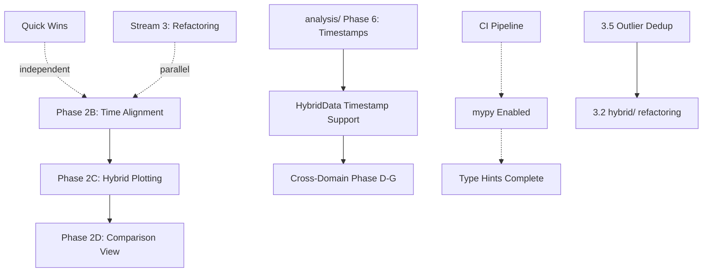

# Development Roadmap — python_magnetrun

*Updated: 2026-04-24*

This document outlines strategic priorities and upcoming work. For detailed implementation status, see [CHECK_IMPLEMENTATION.md](CHECK_IMPLEMENTATION.md). For architectural review, see [REVIEW.md](REVIEW.md).

---

## Current State

**Package Status:** Production-ready for core use cases ✅

**Major Achievements (2026 Q1-Q2):**
- ✅ Housing config consolidation (`HousingConfig` single source of truth)
- ✅ Factory pattern (`load_magnetdata` replacing shim)
- ✅ Protocol unification (`DataLoader` protocol, Phase 2A complete)
- ✅ Timestamp convention (naive UTC across all loaders)
- ✅ Downsampling refactoring (`DownsampleConfig` + shared utilities)
- ✅ Plotting refactoring (backend abstraction + 3 implementations)
- ✅ File validation infrastructure (integrated throughout)
- ✅ Logging infrastructure (`log_utils.py` + structured logging)
- ✅ Test coverage (validation, analysis, processing, CLI smoke tests)

---

## Strategic Priorities

### Priority 1: Stability & Quality (Ongoing)
**Goal:** Package must work reliably in production

### Priority 2: Unified Multi-Source Plotting
**Goal:** Display pupitre + pigbrother + hybrid data on shared axes or side-by-side comparison

### Priority 3: Code Maintainability
**Goal:** Sustainable long-term development with clear architecture

---

## Active Work Streams

### Stream 1: Production Stability (High Priority)

**Known Issues:**
1. **Multiple-file `vs_time` regression** *(commits 86c45c6/76351f3)*
   - Plot timing issues with multiple input files
   - **Action:** Investigate and fix
   - **Effort:** ~1-2 days

2. **CI/CD Pipeline** *(planned)*
   - Add `.github/workflows/ci.yml`
   - Run `ruff` + `pytest` on every push
   - Eventually add `mypy` when type hints are complete
   - **Effort:** ~2-4 hours

3. **Complete logging migration**
   - Infrastructure in place; ~100-200 `print()` calls remain
   - **Action:** Convert to `logger.*` calls opportunistically
   - **Effort:** Ongoing background work

---

### Stream 2: Unified Plotting (Medium Priority)

**Phase 2A: Unified Data Interface** ✅ **COMPLETE**
- `DataLoader` protocol defined
- `MagnetRun` and `HybridRun` both satisfy protocol
- `get_time_range()` and `getDomain()` implemented

**Phase 2B: Time Alignment Layer** 🔶 **PARTIAL**

Current gaps:
- kHz/RMS uses seconds-from-day-start → needs UTC timestamp conversion on load
- Need `align_to_common_time(sources: list[DataLoader])` utility for multi-source sync

**Effort:** ~1-2 weeks

**Phase 2C: Extend `plot_data()` for Hybrid** ⬜ **PLANNED**

Extend `analysis/plotting.plot_data()` with:
```python
def plot_data(
    ...
    df_hybrid: HybridRun | None = None,
    hybrid_channels: list[str] | None = None,
    ...
)
```

**Depends on:** Phase 2B completion
**Effort:** ~2-3 weeks

**Phase 2D: Side-by-Side Comparison** ⬜ **PLANNED**

Extend `plot_comparison()` to accept `list[DataLoader]`:
- Auto-generate subplot grid (source × channel)
- Shared/linked time axis
- Consistent styling across sources

**Depends on:** Phase 2C
**Effort:** ~1-2 weeks

**Phase 2E: Channel Auto-Mapping** 🔶 **PARTIAL**

Build `CHANNEL_ALIASES` registry:
```python
CHANNEL_ALIASES: dict[str, list[str]] = {
    "IH":     ["Courant_GR1", "I_H1", "I_GR1"],
    "FlowH":  ["Debit_GR1", "flow_GR1"],
    # ...
}
```

Current: Structured `ChannelMapping` exists; needs fuzzy fallback
**Effort:** ~1-2 weeks

---

### Stream 3: Internal Refactoring (Lower Priority)

**3.1 `analysis/` Subpackage Refactoring**
- Break up monolithic functions
- Move channel mapping to `HousingConfig`
- Adopt downsampling in `analysis/plotting.py`
- **See:** [analysis-subpackage-refactoring.plan.md](analysis-subpackage-refactoring.plan.md)
- **Effort:** ~5-7 days

**3.2 `hybrid/` Subpackage Refactoring**
- Create `OutlierConfig` dataclass (following `DownsampleConfig` pattern)
- Extract `signal_processing.py` utility module
- **Prerequisite:** 3.5 Outlier deduplication below (clean base for `OutlierConfig`)
- **See:** [hybrid-subpackage-refactoring.plan.md](hybrid-subpackage-refactoring.plan.md)
- **Effort:** ~10-14 hours

**3.3 CLI Consolidation**
- Reduce 8 entry points to 3: `magnetrun` (unified dispatcher), `magnetrun-fetch` (renamed from `srvdata-to-magnetrun`), `magnetrun-config` (unchanged)
- Add `magnetrun signature` subcommand (promoted from `tests/test-signature.py`)
- `register(subparsers)` pattern, subcommand-first argv (eliminates `_normalize_argv` hack)
- Coordinate `analysis/cli.py` pass with `analysis-subpackage-refactoring.plan.md` Phase 5.3
- **See:** [cli-consolidation.plan.md](cli-consolidation.plan.md)
- **Effort:** ~1-2 days

**3.5 Outlier Deduplication** *(do before 3.2)*
- `hybrid/outliers.py` is canonical; `processing/hysteresis.py::remove_outliers` and `examples/outliers.py` reimplement inline
- Delete `examples/outliers.py`; thin-delegate `hysteresis.py::remove_outliers` to canonical module
- Replace two CLI-style anomaly test scripts with a proper pytest module
- **See:** [outlier-consolidation.plan.md](outlier-consolidation.plan.md)
- **Effort:** ~4-5 hours

**3.4 `analysis/__init__.py` Namespace**
- 80+ names exported flat
- Split into `analysis.metrics`, `analysis.plot` sub-namespaces
- **Effort:** ~1 day

---

### Stream 4: Advanced Features (Future)

**4.1 `HybridData` Timestamp Support**
- Add `start_timestamp`, `end_timestamp`, `addTime()` to `HybridData`
- Required before `HybridRun` can participate in `ComparisonSession`
- **Prerequisite:** `analysis/` Phase 6 (`add_time_columns` utility)
- **See:** [hybriddata-timestamp-plan.md](hybriddata-timestamp-plan.md)
- **Effort:** ~0.5 days

**4.2 Cross-Domain Comparison (Phases D-G)**
- Phase B-C (adapters): ✅ Done
- Phase D: Extend `*-defs.json` with simulation/bfield aliases
- Phase E: `ComparisonSession` implementation
- Phase F: `magnetrun-compare` CLI
- Phase G: Comprehensive tests
- **Depends on:** HybridData timestamp support
- **See:** [cross-domain-comparison.prompt.md](cross-domain-comparison.prompt.md)
- **Effort:** ~2-3 weeks

**4.3 Pipeline Redesign (polars/narwhals)**
- Custom npTDMS with polars backend
- narwhals wrapping for framework-agnostic API
- Eliminate double-load performance issue
- **See:** [mrun-cache-implementation.plan.md](mrun-cache-implementation.plan.md)
- **Effort:** XL (multi-phase, ~4-6 weeks)
- **Note:** Package fully functional without this; performance optimization only

**4.4 HoloViews Plotting Migration** *(optional alternative)*
- Replace 3-backend system with HoloViews + Panel + datashader
- Simplifies downsampling integration
- Better interactive plotting
- **See:** [holoviews-migration.plan.md](holoviews-migration.plan.md)
- **Effort:** ~8 days
- **Trade-off:** Replaces existing stable plotting system

---

## Quick Wins (Do These First)

Priority items that provide immediate value with minimal effort:

| Task | Effort | Impact | Status |
|------|--------|--------|--------|
| Fix bare `except:` clauses | 30 min | High reliability gain | ✅ Done |
| Add `ruff` pre-commit hook | 1 hour | Enforces consistency | ✅ Done |
| File validation infrastructure | 4 hours | Early error detection | ✅ Done |
| Add assertions to `test_python_magnetrun.py` | 30 min | Makes CI meaningful | ⬜ Open |
| Remove `pigbrother-defs.json~` | 5 min | Clean repository | ✅ Done |
| Add `*.json~` to `.gitignore` | 2 min | Prevent future backups | ✅ Done |
| Audit TODOs in `requests/cli.py` (rename site→housing, geometry, Parts) | 15 min | Polish | ⬜ Open |
| Enable `mypy` pre-commit hook | 1 hour | Type checking in CI | ⬜ Open |
| Add CI pipeline | 2 hours | Automated testing | ⬜ Open |

---

## Suggested Timeline (Next 6 Months)

```
Month 1 (May 2026)
├─ Fix multiple-file vs_time regression
├─ Add CI/CD pipeline
├─ Quick wins (test assertions, cleanup)
└─ Phase 2B: Time alignment layer (start)

Month 2 (June 2026)
├─ Phase 2B: Time alignment layer (complete)
├─ Phase 2C: Extend plot_data() for hybrid (start)
└─ Logging migration (ongoing)

Month 3 (July 2026)
├─ Phase 2C: Extend plot_data() for hybrid (complete)
├─ Phase 2D: Side-by-side comparison (start)
└─ Enable mypy, type hints backfill (background)

Month 4 (August 2026)
├─ Phase 2D: Side-by-side comparison (complete)
├─ Phase 2E: Channel auto-mapping
└─ analysis/ internal refactoring (start)

Month 5 (September 2026)
├─ analysis/ internal refactoring (complete)
├─ Outlier deduplication (3.5, ~0.5 day)
├─ hybrid/ internal refactoring (3.2, after outlier dedup)
├─ CLI consolidation (3.3, coordinate analysis/cli.py with analysis Phase 5.3)
└─ HybridData timestamp support

Month 6+ (October 2026+)
├─ Cross-domain Phases D-G
├─ Optional: HoloViews migration OR pipeline redesign
└─ Type hints backfill complete, mypy strict mode
```

**Parallelization opportunities:**
- Logging migration runs continuously as background work
- Type hints backfill happens opportunistically during other changes
- Quick wins can be tackled independently by any contributor
- Stream 3 (internal refactoring) work can proceed in parallel with Stream 2 (unified plotting)

---

## Dependencies & Sequencing



**Critical Path:** Phase 2B → 2C → 2D (unified plotting)
**Long Pole:** analysis/ Phase 6 blocks HybridData timestamps
**Independent:** Quick wins, logging migration, CLI consolidation, outlier deduplication, type hints
**Intra-Stream-3 order:** 3.5 Outlier Dedup → 3.2 hybrid/ refactoring; 3.3 CLI consolidation can run in parallel but `analysis/cli.py` must land with analysis Phase 5.3

---

## Success Criteria

**By End of Q2 2026:**
- [ ] CI/CD pipeline running on all PRs
- [ ] Multiple-file plotting regression fixed
- [ ] Quick wins completed

**By End of Q3 2026:**
- [ ] Phase 2B-D complete (unified multi-source plotting)
- [ ] Logging migration >90% complete
- [ ] mypy enabled in CI

**By End of Q4 2026:**
- [ ] HybridData timestamp support complete
- [ ] Cross-domain comparison Phases D-G complete
- [ ] analysis/ and hybrid/ refactoring complete
- [ ] 100% type hints on public APIs

---

## Out of Scope (Deferred)

The following items are recognized but explicitly deferred:

1. **Pipeline redesign (polars/narwhals)** — performance optimization; current implementation is functional
2. **HoloViews migration** — optional alternative to stable existing plotting system
3. **Separation of `python_magnetcooling`** — already a separate submodule; further work tracked separately

---

## Related Documentation

- **[CHECK_IMPLEMENTATION.md](CHECK_IMPLEMENTATION.md)** — Detailed task tracking and current status
- **[REVIEW.md](REVIEW.md)** — Architecture review and resolved issues
- **[CODE_REVIEW.md](CODE_REVIEW.md)** — Code quality guidelines
- **Plan files:** `*-plan.md`, `*-prompt.md` — Detailed implementation plans for specific features

---

## Contributing

When working on roadmap items:

1. Check [CHECK_IMPLEMENTATION.md](CHECK_IMPLEMENTATION.md) for current status
2. Read the relevant plan file for detailed requirements
3. Update both docs when completing phases
4. Keep [REVIEW.md](REVIEW.md) in sync with architectural changes

**Quick start for new contributors:** Start with "Quick Wins" section above.
