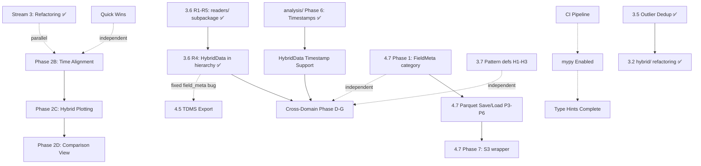

# Development Roadmap — python_magnetrun

*Updated: 2026-06-09*

This document outlines strategic priorities and upcoming work. For detailed implementation status, see [CHECK_IMPLEMENTATION.md](CHECK_IMPLEMENTATION.md). For architectural review, see [REVIEW.md](REVIEW.md).

---

## Current State

**Package Status:** Production-ready for core use cases ✅

**Major Achievements (2026 Q1-Q2):**
- ✅ Housing config consolidation (`HousingConfig` single source of truth; `Ih`/`Ib` via `Idcct`)
- ✅ Factory pattern (`load_magnetdata` replacing shim)
- ✅ Protocol unification (`DataLoader` protocol, Phase 2A complete)
- ✅ Timestamp convention (naive UTC across all loaders)
- ✅ Lazy loading (`PandasMagnetData._ensure_data_loaded` + `TdmsMagnetData._LazyGroupDict`)
- ✅ `Data` as abstract property on `MagnetDataBase` (+ `close()` / context manager)
- ✅ Resilient pupitre loading (encoding fallback, `on_bad_lines`, truncation check)
- ✅ `addData`/`computeData` metadata (`symbol`/`unit`/`label`/`description` → `FieldMeta`)
- ✅ `HybridRun.getData` formula-key resolution (`hybrid_formula_map` via `_resolve_hybrid_formula`)
- ✅ Downsampling refactoring (`DownsampleConfig` + shared utilities)
- ✅ Plotting refactoring (backend abstraction + 3 implementations)
- ✅ File validation infrastructure (integrated throughout)
- ✅ Logging infrastructure (`log_utils.py` + structured logging)
- ✅ Test coverage (validation, analysis, processing, CLI smoke tests, truncated pupitre, hybrid formula)
- ✅ `analysis/` subpackage refactoring (all 6 phases: data loading, downsampling, channel mapping, function decomposition, time-column utility)
- ✅ Outlier deduplication (canonical `python_magnetrun/outliers.py`; `hybrid/outliers.py` is a shim; `hysteresis.py` thin-delegates; `tests/test_outliers.py` 142 tests; `ISOLATION_FOREST` added to `OutlierMethod`)
- ✅ `hybrid/` subpackage refactoring — all 6 phases (`OutlierConfig` dataclass, `OUTLIER_DEFAULTS`, `processing/signal.py`, cache-eviction docstring, all-NaN / file-existence guards, typed exceptions; 866 tests pass)
- ✅ Reader/container split (`readers/` subpackage; `PupitreReader`, `BProfileReader`, `EnsightReader`, `FeelppReader`, `CsvReader`, `TdmsReader`, `HtsReader`, `HybridReader`; `DataType.HTS = 4`; `HybridData` joins `MagnetDataBase` hierarchy, fixing `field_meta` init bug; `READERS`/`CONTAINERS` registry + `detect_type()`; 46 new tests; 971 pass)
- ✅ Phase 2B: Time Alignment Layer complete — `utc_hour_to_local()` in `hybrid/utils.py`; UTC `hours` in `read_khz_variable`/`read_rms_variable`; `_khz_first_last_utc()` + `HybridRun.get_time_range()` fix; RMS time origin from UTC midnight; `align_to_common_time(sources, reference, hours)` in `utils/timestamps.py`; demonstrator refactored; 1052 tests pass
- ✅ `BinarizeConfig` dataclass in `hybrid/hybrid_run.py` (`method`, `tolerance`, `n_bins`, `normalize`, `noise_percentile`); wired into `LoadOptions` and `getData` flow
- ✅ `comparison/cli.py` stub + `register()` wired into unified dispatcher — `magnetrun compare` now discoverable

---

## Strategic Priorities

### Priority 1: Stability & Quality (Ongoing)
**Goal:** Package must work reliably in production

### Priority 2: Unified Multi-Source Plotting
**Goal:** Display pupitre + pigbrother + hybrid data on shared axes or side-by-side comparison

### Priority 3: Code Maintainability
**Goal:** Sustainable long-term development with clear architecture

---

## Active Work Streams

### Stream 1: Production Stability (High Priority)

**Known Issues:**
1. **Multiple-file `vs_time` regression** *(commits 86c45c6/76351f3)*
   - Plot timing issues with multiple input files
   - **Action:** Investigate and fix
   - **Effort:** ~1-2 days

2. **CI/CD Pipeline** ✅ **Already in place**
   - `test.yml`: pytest on Ubuntu 24.04 (Python 3.11–3.14) + Debian Trixie; coverage uploaded to Codecov
   - `docs.yml`: documentation build on push
   - `ruff` enforced via pre-commit hook (`--fix`); no need to duplicate in CI
   - Remaining: enable `mypy` when type hints are complete

3. **Complete logging migration**
   - Infrastructure in place; ~100-200 `print()` calls remain
   - **Action:** Convert to `logger.*` calls opportunistically
   - **Effort:** Ongoing background work

---

### Stream 2: Unified Plotting (Medium Priority)

**Phase 2A: Unified Data Interface** ✅ **COMPLETE**
- `DataLoader` protocol defined
- `MagnetRun` and `HybridRun` both satisfy protocol
- `get_time_range()` and `getDomain()` implemented

**Phase 2B: Time Alignment Layer** ✅ **COMPLETE**

**How t0 works per source:**
- **Pupitre** (`MagnetRun.from_txt`): header timestamp is local time → `local_to_utc_naive()` → `StartTime` = naive UTC. `get_time_range()` returns `(StartTime, StartTime + duration)`.
- **Pigbrother** (`MagnetRun.fromtdms`): `wf_start_time` TDMS property is already UTC → `ensure_utc_naive()` → `StartTime` = naive UTC. `get_time_range()` reads `wf_start_time` directly.
- **Hybrid kHz**: `compute_hour_t0(first_bin_file, date_str)` extracts `HH` from filename (UTC). `getData()` returns elapsed seconds from this t0. `HybridRun.get_time_range()` now calls `_khz_first_last_utc(hdata)` for an accurate `(t_start, t_end)` from bin-file UTC hours.
- **Hybrid RMS**: time is now seconds since UTC midnight of the recording date.

**Completed tasks:**

- ✅ **B0.5** — `utc_hour_to_local()` added to `hybrid/utils.py`; `read_khz_variable` / `read_rms_variable` use UTC `hours` directly; `_utc_hour_to_local` closure removed from `analysis/processing.py` (`ca4b41a`)
- ✅ **B1** — `_khz_first_last_utc(hdata)` helper in `hybrid_data.py`; `HybridRun.get_time_range()` now calls it (`e397101`)
- ✅ **B2** — RMS time origin changed to seconds since UTC midnight of recording date (`e397101`)
- ✅ **B2.5** — `plot_rms_variable` uses stashed `orig_data`/`orig_time` in both highlight branches; double-read eliminated
- ✅ **B3** — `align_to_common_time(sources, reference, hours)` in `utils/timestamps.py` (`e67233c`, `fb79656`)
- ✅ **B4** — demonstrator `examples/plot_hybrid_with_pupitre_tdms.py` refactored to use `align_to_common_time()` (`1ab50de`)

**See:** [phase2b-time-alignment.plan.md](phase2b-time-alignment.plan.md) for full analysis.

**Phase 2C: Extend `plot_data()` for Hybrid** ⬜ **PLANNED**

Extend `analysis/plotting.plot_data()` with:
```python
def plot_data(
    ...
    df_hybrid: HybridRun | None = None,
    hybrid_channels: list[str] | None = None,
    ...
)
```

**Depends on:** Phase 2B — ✅ **now complete**
**Effort:** ~2-3 weeks

**Phase 2D: Side-by-Side Comparison** ⬜ **PLANNED**

Extend `plot_comparison()` to accept `list[DataLoader]`:
- Auto-generate subplot grid (source × channel)
- Shared/linked time axis
- Consistent styling across sources

**Depends on:** Phase 2C
**Effort:** ~1-2 weeks

**Phase 2E: Channel Auto-Mapping** 🔶 **PARTIAL**

Cross-domain alias resolution is handled by `KeyMapping` (Phase D of the cross-domain plan),
which is a thin resolver on top of `field_defs.build_crossref()`. Alias data lives exclusively
in the `*-defs.json` files under the `"aliases"` key — no hardcoded dict.

`simulation` and `bfield` alias entries still need to be added to the JSON files (Phase D0).
Current: `ChannelMapping` exists for TDMS internal mappings; `KeyMapping` in `comparison/key_mapping.py` not yet created.

**Effort:** ~1-2 weeks (shared with cross-domain Phase D)

---

### Stream 3: Internal Refactoring (Lower Priority)

**3.1 `analysis/` Subpackage Refactoring** ✅ **COMPLETE** *(branch `rework_analysis`)*
- All 6 phases done: dead-code removal, logging migration, directory constants, downsampling adoption (`DownsampleConfig`), data-loading consolidation (`utils/files.py` canonical), channel mapping moved to `HousingConfig` (4 new methods), `discover()` / `process_overview_file()` / `main()` decomposed into helpers, `add_time_columns` utility in `utils/timestamps.py`
- **See:** [analysis-subpackage-refactoring.plan.md](analysis-subpackage-refactoring.plan.md)
- **866 tests pass, 6 skipped**

**3.2 `hybrid/` Subpackage Refactoring** ✅ **COMPLETE** *(branch `rework_analysis`)*
- All 6 phases done: print→logger, outlier dedup, `OUTLIER_DEFAULTS`, `OutlierConfig` dataclass, `processing/signal.py` extraction, cache-eviction method, edge-case guards, typed exceptions
- Canonical outlier module: `python_magnetrun/outliers.py`; `hybrid/outliers.py` is a backward-compat shim
- Signal processing: `python_magnetrun/processing/signal.py` (`normalize_signal`, `binarize_signal`, `_otsu_threshold`)
- CLI plumbing: `create_outlier_parser` / `args_to_outlier_config` in `cli_args.py`
- **See:** [hybrid-subpackage-refactoring.plan.md](hybrid-subpackage-refactoring.plan.md)
- **866 tests pass, 6 skipped**

**3.3 CLI Consolidation** ✅ **COMPLETE** *(branch `rework_analysis`)*
- Single `magnetrun` dispatcher with 13 subcommands: info, add, plot, select, stats, signature, analysis, processing, hybrid, logparser, fetch, config (+ compare placeholder)
- `register(subparsers)` pattern on all modules; subcommand-first argv; `_normalize_argv` removed from `cli.py`
- New files: `python_magnetrun/main.py`, `commands/info.py`, `commands/signature.py`, `commands/_shared.py`
- Old entry points kept as deprecated aliases in `pyproject.toml` for one release cycle
- `magnetrun compare` remains pending (blocked on `comparison/cli.py` — Phase F of cross-domain comparison)
- **See:** [cli-consolidation.plan.md](cli-consolidation.plan.md)

**3.5 Outlier Deduplication** ✅ **COMPLETE**
- `examples/outliers.py` deleted; `processing/hysteresis.py::remove_outliers` thin-delegates to `detect_outliers()` (~120 lines → ~15 lines)
- `tests/test-anomalies.py` + `tests/test-anomalies-optimized.py` deleted; replaced by `tests/test_outliers.py` (142 tests, synthetic data)
- `ISOLATION_FOREST` added to `OutlierMethod`; `_VALID_METHODS` in `hysteresis.py` updated
- Canonical module moved to `python_magnetrun/outliers.py` (as part of 3.2); `hybrid/outliers.py` is a shim
- **See:** [outlier-consolidation.plan.md](outlier-consolidation.plan.md)

**3.4 `analysis/__init__.py` Namespace** ✅ **COMPLETE** *(branch `rework_analysis`)*
- Metrics and plotting removed from flat namespace; accessible only via `analysis.metrics.*` and `analysis.plotting.*`
- Remaining flat exports: config, loaders, synchronization, processing, downsampling (analysis-level conveniences)

**3.6 Reader/Container Split** ✅ **COMPLETE** *(branch `rework_analysis`)*
- `python_magnetrun/readers/` subpackage created with `Reader` protocol, 8 reader classes, and `READERS`/`CONTAINERS` registry
- R1: `PupitreReader`, `BProfileReader`, `EnsightReader`, `FeelppReader`, `CsvReader` — factory classmethods in `magnetdata_pandas.py` now delegate to readers
- R2: `TdmsReader` — `_fromtdms()` delegates validate + t-offset lookup; `required_group` centralised on reader
- R3: `HtsReader` + `DataType.HTS = 4` (`;`-sep, units-in-header format with `extracted_units()`)
- R4: `HybridData` inherits `MagnetDataBase`; `Data`/`Type` as abstract properties; `extractData`/`renameData` stubs; `getData` accepts `downsample` kwarg; `field_meta` init bug fixed for free; `HybridReader` composite reader
- R5: `readers/registry.py` (`READERS`, `CONTAINERS`, `detect_type()`); `load_magnetdata()` accepts `fmt=` override and uses registry dispatch
- **See:** [reader-container-refactoring.plan.md](reader-container-refactoring.plan.md)
- **971 tests pass** (925 existing + 46 new in `tests/readers/`)

**3.8 Downsampling Extensions**

*3.8a — M4 / NaN-M4* ✅ **COMPLETE**
- `m4` and `nan_m4` methods implemented in `utils/downsampling.py`
- Uses `M4Downsampler` / `NaNM4Downsampler` from `tsdownsample`
- `nan_m4` bypasses NaN-strip path to preserve gaps in output
- Tests: `tests/test_downsampling.py`
- **See:** [m4-downsampling.plan.md](m4-downsampling.plan.md)

*3.8b — RDP / Visvalingam-Whyatt* ✅ **COMPLETE**
- `rdp` and `vw` methods implemented in `utils/downsampling.py`
- `epsilon: float | None = None` field added to `DownsampleConfig`
- `DownsampleConfig.from_n_out_rdp()` binary-search factory implemented
- Optional dependency: `simplification>=0.7` in `[project.optional-dependencies] rdp`
- Tests: `tests/test_downsampling.py`
- **See:** [rdp-downsampling.plan.md](rdp-downsampling.plan.md)

*3.8c — Downsampling Quality Metrics* ✅ **COMPLETE**
- `utils/downsampling_metrics.py` with `DownsampleMetrics` dataclass (RMSE, MAE, max error, MAPE, Hausdorff, peak error, energy ratio, timing, memory)
- `evaluate_downsampling(data, time, config)`, `evaluate_downsampling_segments()`, `benchmark_configs(configs)` implemented
- All exported via `utils/__init__.py`
- Tests: `tests/test_downsampling_metrics.py`
- **See:** [downsampling-metrics.plan.md](downsampling-metrics.plan.md)

**3.7 Pattern Entries in `*-defs.json`** ⬜ **PLANNED**
- feelpp/paraview data can have 100s of similarly-named columns (`U_0`…`U_239`)
- Add `"match"` regex key support to `load_units_from_json()` (two-pass: exact first, patterns second)
- New `feelpp-defs.json` with pattern entries; `FeelppMagnetData` and `SimulationRun` default to it
- Backward-compatible: existing exact-match JSON files unchanged
- **See:** Phase H of [cross-domain-comparison.prompt.md](cross-domain-comparison.prompt.md)
- **Effort:** S (~2 hours)

**3.9 Hybrid Subpackage Code Quality** 🔶 **IN PROGRESS** *(from [docs/hybrid_refactoring_notes.md](../docs/hybrid_refactoring_notes.md))*

Items 2 and 3 from the notes are already tracked as B0.5 and B2.5 in Phase 2B. Items 12 and 13 (docs-only cross-refs and a rename) are in Quick Wins.

**See:** [3.9-hybrid-code-quality.plan.md](3.9-hybrid-code-quality.plan.md) for full item tracking.

*Small (S) — low risk, do any time:*
- **S1 — `safe_float` module-level** (notes item 5): hoist the two nested `safe_float` definitions to module level in [hybrid/kHz/fepc_reader.py](../python_magnetrun/hybrid/kHz/fepc_reader.py) (lines 298 and 435).
- ✅ **S2 — Consolidate `_resolve_backend`** (notes items 6/15): deleted both local definitions; all 6 call sites now use `get_backend` directly (which already handles `PlottingBackend` instances). **1071 tests pass.**

*Medium (M) — low-to-medium risk:*
- **M1 — Unify `log_exception` + `format_exception_location`** (notes items 9/11): standardise on the `log_utils.py` signature (explicit `logger` arg); update six call sites in `hybrid/cli.py`; delete the duplicate in [hybrid/utils.py](../python_magnetrun/hybrid/utils.py).
- **M2 — Standardise `range` schema** (notes item 14): adopt dict schema `{"start": …, "end": …}` for both `compute_lag` and `lag_correlation` in [analysis/synchronization.py](../python_magnetrun/analysis/synchronization.py); update caller in `analysis/processing.py:_compute_lag_correlation` (currently uses tuple).
- **M3 — Deprecate `processing.correlations` lag functions** (notes item 8): add deprecation shims in [processing/correlations.py](../python_magnetrun/processing/correlations.py) that forward to `analysis.synchronization` equivalents; unify `range` schema (dict) and update callers.
- **M4 — Share CNV calibration helper** (notes items 7/16): extract `_apply_cnv_calibration(data, cnv_path) -> np.ndarray` into `hybrid/utils.py`; reuse it in `hybrid/kHz/fepc_reader.py:apply_calibration` and `hybrid/trigger/trigger_reader.py:apply_calibration`.

*Large (L) — medium risk, plan separately before starting:*
- ✅ **L1 — Extract `_plot_variable_impl` / `_plot_variables_impl`** (notes items 3/4): unified `plot_khz_variable`/`plot_rms_variable` and `plot_khz_variables`/`plot_rms_variables` in [hybrid/plotting.py](../python_magnetrun/hybrid/plotting.py); fixed RMS missing `downsample` param, unlabelled y-axes, and `_scatter_outliers` not receiving downsample args. 7 new tests. **1071 tests pass.**
- **L2 — Extract `_BinaryFileReaderBase`** (notes item 1): abstract base class for `RMSFileReader` ([hybrid/rms/rms_reader.py](../python_magnetrun/hybrid/rms/rms_reader.py)) and `VProcessFileReader` ([hybrid/vprocess/vprocess_reader.py](../python_magnetrun/hybrid/vprocess/vprocess_reader.py)); merge `RMSVariable`/`VProcessVariable` into a single `ChannelVariable` dataclass; subclass only encoding and timestamp-conversion differences.

**Note:** trigger/VProcess integration into `HybridData` (notes item 10) is tracked as Stream 4.6.
**Effort:** S items ~30 min each · M items ~0.5 day each · L items ~1–2 days each

---

### Stream 4: Advanced Features (Future)

**4.1 `HybridData` Timestamp Support** ⬜ **UNBLOCKED**
- Add `start_timestamp`, `end_timestamp`, `addTime()` to `HybridData`
- Required before `HybridRun` can participate in `ComparisonSession`
- **Prerequisite:** `analysis/` Phase 6 (`add_time_columns` utility) — ✅ **now complete**
- **See:** [hybriddata-timestamp-plan.md](hybriddata-timestamp-plan.md)
- **Effort:** ~0.5 days

**4.2 Cross-Domain Comparison (Phases D-G + H)**
- Phase B-C (adapters): ✅ Done
- **Phase H:** Pattern entries in `*-defs.json` + `feelpp-defs.json` (independent, do any time — see Stream 3.7)
- Phase D: Extend `*-defs.json` with simulation/bfield aliases; `KeyMapping` (reuses `field_defs.build_crossref()`)
- Phase E: `ComparisonSession` implementation; cleaner now that Stream 3.6 R4 is complete (`HybridData` in hierarchy)
- Phase F: `magnetrun compare` subcommand via `comparison/cli.py::register()` — ✅ **stub registered** (`f87e8ce`, `c13c179`); handler raises `NotImplementedError` until Phase E (`ComparisonSession`) is complete
- Phase G: Comprehensive tests
- **Depends on:** HybridData timestamp support; CLI consolidation (Stream 3.3) should land first or in the same branch; Phase E significantly cleaner after Stream 3.6 R4
- **See:** [cross-domain-comparison.prompt.md](cross-domain-comparison.prompt.md)
- **Effort:** ~2-3 weeks

**4.5 TDMS Export**
- `PandasMagnetData.to_tdms()` — export pupitre data resampled to 1 Hz; group/channel mapping via `_tdms_groups` key in `pupitre-defs.json`; deduplication of repeated timestamps in `addTime()`
- `HybridData.to_rms_tdms()` + `to_khz_tdms()` — export RMS and kHz hybrid data; group mapping via `_tdms_groups_rms` / `_tdms_groups_khz` in `hybrid-defs.json`; fallback group per FEPC system for unassigned channels
- **Prerequisite:** `HybridData.field_meta` initialisation bug — ✅ **fixed by Stream 3.6 R4** (`HybridData` now inherits `MagnetDataBase.__init__` which sets `self.field_meta = {}`)
- Reuses existing `nptdms` (already a dependency); channel names derived from `aliases.pigbrother` when available
- **See:** [pupitre_to_tdms_export.md](pupitre_to_tdms_export.md), [hybrid_to_tdms_export.md](hybrid_to_tdms_export.md)
- **Effort:** M (pupitre) + M (hybrid RMS) + M (hybrid kHz)
- **Independent of Phases D–G** — can be done any time after `addTime()` is stable

**4.6 Trigger & VProcess Integration into `HybridData`** ⬜ **PLANNED**
- Add `read_trigger_variable`, `read_vprocess_variable`, `plot_trigger_variable`, `plot_vprocess_variable` to the `HybridData` interface in [hybrid/hybrid_data.py](../python_magnetrun/hybrid/hybrid_data.py)
- Currently trigger and vprocess readers exist and work independently but are unreachable via the unified `HybridData` API (notes item 10)
- **Depends on:** Stream 3.9 L2 (`_BinaryFileReaderBase`) for a clean, non-duplicated integration
- **Effort:** XL
- **See:** [docs/hybrid_refactoring_notes.md](../docs/hybrid_refactoring_notes.md) item 10

**4.7 Parquet Save/Load with Rich Metadata** ⬜ **PLANNED**

**Goal:** Self-describing persistent format for `MagnetDataBase` instances — survives the round-trip through ETL and S3 storage (RustFS) without the original raw file or defs JSON.

**Key design decisions:**
- `pyarrow` for the saver; `polars` stays in `rustfs/magnetfs` (D8)
- `pint.Unit` serialised as `str(unit)` UTF-8; `""` represents `None` (D1)
- `FieldMeta` gains `category: str = ""` (TDMS group, pupitre bucket, hybrid prefix) instead of a degenerate `Groups` dict (D2)
- `timestamp` column dropped from saved data; reconstructed lazily via `getTimestamp()` from `t + start_timestamp` (D3)
- `start/end_timestamp` stored as split `(seconds, nanos)` byte-string pair for nanosecond precision (D4)
- `properties: dict` on `MagnetDataBase`; caller-populated via `setProperty()` before `saveParquet()` (D5)
- One group per Parquet file initially; multi-group manifest layout deferred to Phase 8 (D6)
- S3 layer lives in `rustfs/magnetfs`, not in `python_magnetrun` — `saveParquet` accepts `IO[bytes]` (D7)

**Phases:**

| Phase | Task | Effort |
|-------|------|--------|
| 1 | `category: str = ""` on `FieldMeta`; `load_units_from_json` reads it; `addData`/`computeData` gain `category=`; editorial: add `"category"` to all three defs JSON files | S |
| 2 | `properties: dict = {}` on `MagnetDataBase.__init__`; `setProperty`/`getProperty` methods | S |
| 3 | New `python_magnetrun/io/parquet.py` — serialization helpers, `_serialize_unit`, `_serialize_field_meta`, timestamp helpers; `PandasMagnetData.saveParquet` + `loadParquet` | M |
| 4 | `getTimestamp()` lazy materialiser on `MagnetDataBase`; audit `extractTimeData` / alignment code | S |
| 5 | `TdmsMagnetData.saveParquet(target, group=)` + `loadParquet`; category derived from key prefix | M |
| 6 | `load_magnetrun_parquet()` factory (dispatches on `magnetrun.source_type`); `MagnetRun.fromparquet` + `saveParquet` | S |
| 7 | S3 thin wrappers in `rustfs/magnetfs/parquet_io.py` (`save_to_s3`/`load_from_s3`); `magnetfs` CLI gains `magnetrun-save`/`magnetrun-load` subcommands | M |
| 8 | Multi-group manifest layout (`run.parquet/` dir + `_manifest.json`); HybridRun integration | XL — **deferred** |

**Execution order:** 1 → 2 → 3 → 4 → 5 → 6 → 7; Phase 8 deferred until single-group case is proven.

**New optional dependency:** `pyarrow` (add as `io` extras group in `pyproject.toml`).

**Depends on:** nothing — fully independent of all current work streams. Phase 1 (`category` on `FieldMeta`) is useful on its own even if Phases 3–7 are deferred.

**Effort:** S + S + M + S + M + S + M = ~3 days (Phases 1–7); Phase 8 XL separate.

**See:** [parquet-save-load.plan.md](parquet-save-load.plan.md) — full design decisions (D1–D8), metadata schema v1, API, open questions (S3 key convention, boto3 dep, compression, `properties` shape).

---

**4.3 Pipeline Redesign (polars/narwhals)**
- Custom npTDMS with polars backend
- narwhals wrapping for framework-agnostic API
- Eliminate double-load performance issue
- **See:** [mrun-cache-implementation.plan.md](mrun-cache-implementation.plan.md)
- **Effort:** XL (multi-phase, ~4-6 weeks)
- **Note:** Package fully functional without this; performance optimization only

**4.4 HoloViews Plotting Migration** *(optional alternative)*
- Replace 3-backend system with HoloViews + Panel + datashader
- Simplifies downsampling integration
- Better interactive plotting
- **See:** [holoviews-migration.plan.md](holoviews-migration.plan.md)
- **Effort:** ~8 days
- **Trade-off:** Replaces existing stable plotting system

---

## Quick Wins (Do These First)

Priority items that provide immediate value with minimal effort:

| Task | Effort | Impact | Status |
|------|--------|--------|--------|
| Fix bare `except:` clauses | 30 min | High reliability gain | ✅ Done |
| Add `ruff` pre-commit hook | 1 hour | Enforces consistency | ✅ Done |
| File validation infrastructure | 4 hours | Early error detection | ✅ Done |
| Add assertions to `test_python_magnetrun.py` | 30 min | Makes CI meaningful | ✅ Done |
| Remove `pigbrother-defs.json~` | 5 min | Clean repository | ✅ Done |
| Add `*.json~` to `.gitignore` | 2 min | Prevent future backups | ✅ Done |
| Audit TODOs in `requests/cli.py` (rename site→housing, geometry, Parts) | 15 min | Polish | ⬜ Open |
| Enable `mypy` pre-commit hook | 1 hour | Type checking in CI | ⬜ Open |
| Enable `mypy` in pre-commit / CI | 1 hour | Type checking enforced | ⬜ Open |
| Add cross-refs between `remove_outliers` variants (notes item 12) | S | Readability | ⬜ Open |
| Rename `commands/plot.py:_handle_output` → `_save_or_show_figure` (notes item 13) | S | Readability | ⬜ Open |

---

## Suggested Timeline (Next 6 Months)

```
Month 1 (May 2026)
├─ Fix multiple-file vs_time regression
├─ Quick wins (test assertions, cleanup)
└─ Phase 2B: Time alignment layer (start)

Month 2 (June 2026)
├─ Phase 2B: Time alignment layer ✅ DONE (B0.5–B4 all landed; see commits ca4b41a…fb79656)
├─ Phase 2C: Extend plot_data() for hybrid (start) ← NOW UNBLOCKED
└─ Logging migration (ongoing)

Month 3 (July 2026)
├─ Phase 2C: Extend plot_data() for hybrid (complete)
├─ Phase 2D: Side-by-side comparison (start)
└─ Enable mypy, type hints backfill (background)

Month 4 (August 2026)
├─ Phase 2D: Side-by-side comparison (complete)
└─ Phase 2E: Channel auto-mapping

Month 5 (September 2026)
├─ CLI consolidation (3.3, analysis/cli.py decomposition already done)
└─ HybridData timestamp support (unblocked — analysis/ Phase 6 + hybrid/ refactoring both complete)

Month 6+ (October 2026+)
├─ Cross-domain Phases D-G
├─ Optional: HoloViews migration OR pipeline redesign
└─ Type hints backfill complete, mypy strict mode
```

**Parallelization opportunities:**
- Logging migration runs continuously as background work
- Type hints backfill happens opportunistically during other changes
- Quick wins can be tackled independently by any contributor
- Stream 3 (internal refactoring) work can proceed in parallel with Stream 2 (unified plotting)

---

## Dependencies & Sequencing



**Critical Path:** Phase 2B → 2C → 2D (unified plotting)
**Unblocked:** HybridData timestamps — analysis/ Phase 6 (`add_time_columns`) and hybrid/ refactoring are both complete
**Improves Phase E:** Stream 3.6 R4 (`HybridData` joins hierarchy) ✅ complete — Phase E can now be implemented cleanly
**Independent:** Quick wins, logging migration, CLI consolidation, type hints, Stream 3.7 (pattern defs), Stream 3.8a/b/c (downsampling extensions — all additive)
**Stream 3 status:** 3.1 analysis/ ✅ · 3.2 hybrid/ ✅ · 3.3 CLI ✅ · 3.4 namespace ✅ · 3.5 outlier dedup ✅ · 3.6 reader split ✅ · 3.8a M4/NaN-M4 ✅ · 3.8b RDP/VW ✅ · 3.8c metrics ✅ · 3.7 pattern defs open · 3.9 code quality open
**Phase 2B status:** ✅ complete (B0.5 · B1 · B2 · B2.5 · B3 · B4 all done; 1052 tests pass)

---

## Success Criteria

**By End of Q2 2026:**
- [x] CI/CD pipeline running on all PRs (`test.yml` + `docs.yml` already in place; `ruff` via pre-commit)
- [x] Phase 2B: Time Alignment Layer complete
- [ ] Multiple-file plotting regression fixed
- [ ] Quick wins completed

**By End of Q3 2026:**
- [ ] Phase 2B-D complete (unified multi-source plotting)
- [ ] Logging migration >90% complete
- [ ] mypy enabled in CI

**By End of Q4 2026:**
- [ ] HybridData timestamp support complete
- [ ] Cross-domain comparison Phases D-G complete
- [x] `analysis/` subpackage refactoring complete
- [x] `hybrid/` subpackage refactoring complete
- [ ] 100% type hints on public APIs

---

## Out of Scope (Deferred)

The following items are recognized but explicitly deferred:

1. **Pipeline redesign (polars/narwhals)** — performance optimization; current implementation is functional
2. **HoloViews migration** — optional alternative to stable existing plotting system
3. **Separation of `python_magnetcooling`** — already a separate submodule; further work tracked separately

---

## Related Documentation

- **[CHECK_IMPLEMENTATION.md](CHECK_IMPLEMENTATION.md)** — Detailed task tracking and current status
- **[REVIEW.md](REVIEW.md)** — Architecture review and resolved issues
- **[CODE_REVIEW.md](CODE_REVIEW.md)** — Code quality guidelines
- **[phase2b-time-alignment.plan.md](phase2b-time-alignment.plan.md)** — Phase 2B detailed plan (hours semantics, get_time_range fix, align_to_common_time)
- **[parquet-save-load.plan.md](parquet-save-load.plan.md)** — Stream 4.7: Parquet save/load design (D1–D8 decisions, metadata schema v1, 8-phase implementation plan, S3 integration)
- **Plan files:** `*-plan.md`, `*-prompt.md` — Detailed implementation plans for specific features

---

## Contributing

When working on roadmap items:

1. Check [CHECK_IMPLEMENTATION.md](CHECK_IMPLEMENTATION.md) for current status
2. Read the relevant plan file for detailed requirements
3. Update both docs when completing phases
4. Keep [REVIEW.md](REVIEW.md) in sync with architectural changes

**Quick start for new contributors:** Start with "Quick Wins" section above.
